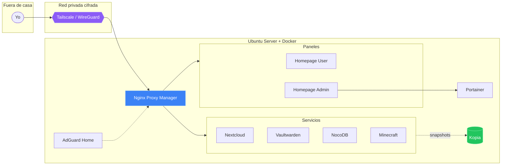
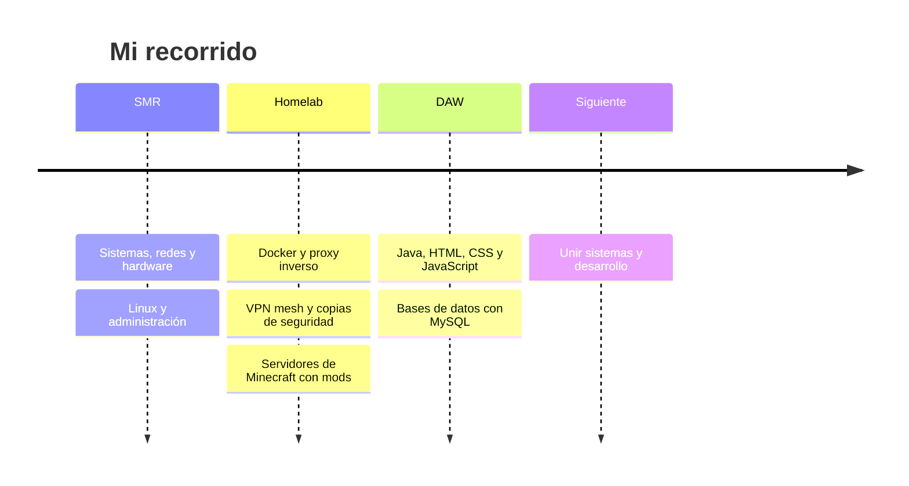
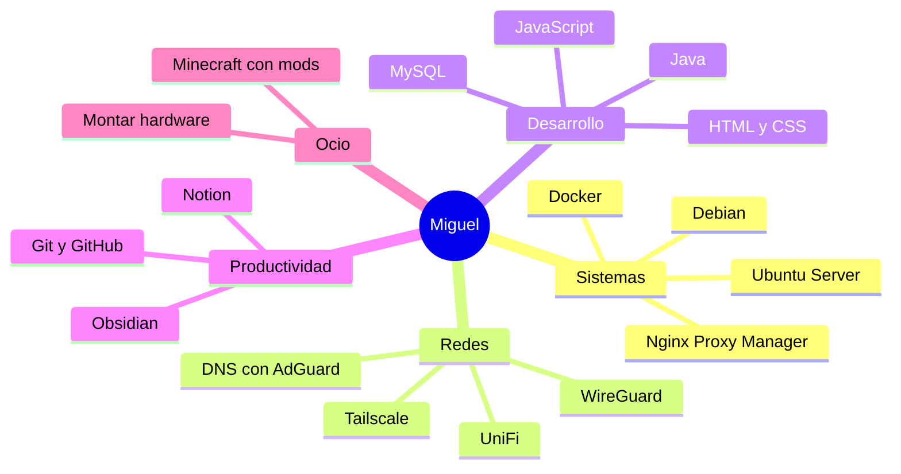

<div align="center">
  
</div>

<div align="center">

[](#)
[](#)
[](#)
[](#)
[](#)

</div>

<br>

<div align="center">
  
</div>

<br>


## `~/sobre-mi`

```json
{
  "nombre": "Miguel",
  "roles": ["SysAdmin", "Homelabber", "DAW Developer"],
  "formacion": {
    "titulado": "SMR - Sistemas Microinformáticos y Redes",
    "cursando": "DAW - Desarrollo de Aplicaciones Web"
  },
  "obsesiones": ["Docker", "Linux", "redes", "organización personal"],
  "disfruta": [
    "montar hardware",
    "configurar switches UniFi",
    "optimizar sistemas Linux",
    "administrar servidores de Minecraft con mods"
  ],
  "lema": "romper cosas, arreglarlas y apuntar cómo lo hice"
}
```

> [!NOTE]
> Todo lo que aprendo en clase lo pruebo después en mi homelab, y todo lo que rompo en el homelab acaba documentado en mis apuntes.


## `~/skills`

**💻 Desarrollo**

<p>
  
</p>

**🐧 Sistemas, contenedores y redes**

<p>
  
</p>


**🛠 Herramientas y productividad**

<p>
  
</p>


## `~/homelab`

Un servidor casero sobre **Ubuntu Server** que funciona como mi campo de pruebas.



```text
$ docker ps --format "table {{.Names}}\t{{.Image}}"
NAMES                  ROL
nginx-proxy-manager    Proxy inverso
adguard-home           DNS local y filtrado
portainer              Gestión de contenedores
homepage-user          Panel de usuario
homepage-admin         Panel de administración
nextcloud              Nube personal
vaultwarden            Gestor de contraseñas
nocodb                 Bases de datos con interfaz visual
kopia                  Copias de seguridad
minecraft              Servidor con mods
```

<details>
<summary><b>🎨 Detalle: los dos Homepage con estilo glassmorphism</b></summary>

<br>

Monté **dos paneles** con [Homepage](https://gethomepage.dev/) para separar lo cotidiano de lo crítico:

| Panel | Para qué sirve |
|---|---|
| 🙋 **User** | Accesos a servicios del día a día, sin exponer nada de administración |
| 🛡 **Admin** | Portainer, Kopia, Nginx Proxy Manager, métricas del host y estado de contenedores |

El diseño usa `custom.css` con `backdrop-filter: blur`, bordes translúcidos y tarjetas flotantes. Curiosidad: Homepage está hecha con Next.js, así que no hay ningún `.html` que editar; todo se controla con `.yaml` y CSS.

</details>


## `~/camino`




## `~/retos-resueltos`

Los errores que más me han enseñado, y cómo salí de ellos:

<details>
<summary><b>🔥 Nginx no arrancaba por un upstream huérfano</b></summary>

<br>

Tras reorganizar contenedores, quedó un proxy host apuntando a un servicio de autenticación que ya no existía y Nginx abortaba el arranque.

```text
nginx: [emerg] host not found in upstream "authelia"
```

**Solución:** probar la configuración con `nginx -t`, renombrar el archivo afectado a `.disabled` y recargar en caliente con `nginx -s reload`.

</details>

<details>
<summary><b>🌐 Conectar a mi red privada desde una red restringida</b></summary>

<br>

Desde una red con proxy y cortafuegos fallaron, uno tras otro, la autenticación (403), un registro de nodo duplicado y el DNS.

- **403 en el login:** hacerlo desde otra red o saltarse el navegador con una Auth Key.
- **`nodekey already exists`:** `tailscale logout` y reautenticar con `--force-reauth`.
- **Sin internet al conectar:** evitar que la VPN sustituya el DNS con `--accept-dns=false`.

**Lección:** probar por IP antes que por dominio separa los problemas de red de los de DNS.

</details>

<details>
<summary><b>💾 Que las copias de seguridad no mientan</b></summary>

<br>

Al mover y borrar carpetas, las políticas de Kopia apuntaban a rutas que ya no existían. Limpié los snapshots huérfanos y lancé uno manual para dejar guardado el estado bueno.

**Regla:** cada reorganización termina con revisión de rutas y un snapshot manual.

</details>

<details>
<summary><b>🧱 Permisos rotos y base de datos en solo lectura</b></summary>

<br>

Borrar carpetas que alojaban volúmenes de Docker dejó a Nginx Proxy Manager con la base de datos en modo lectura (errores 502 y 403).

**Solución:** parar el stack, reajustar propietarios y permisos, limpiar redes huérfanas y volver a levantarlo.

</details>


## `~/mapa-mental`




## `~/ahora`

| 📚 Estudiando | 🔬 Practicando | 🧠 Organizando |
|:---:|:---:|:---:|
| Grado Superior en **DAW** | Docker, redes, VPN y backups en mi homelab | Apuntes en **Obsidian** y bases de datos en **Notion** |

<br>

<div align="center">
  <sub>💜 Gracias por pasarte por mi perfil · Siempre aprendiendo, siempre rompiendo y arreglando cosas</sub>
</div>

<div align="center">
  
</div>
