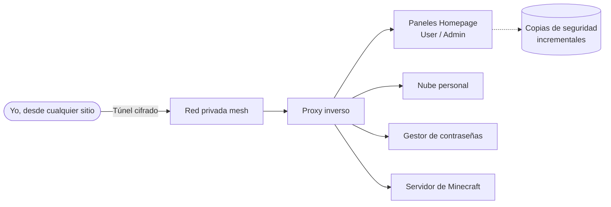

  

  

 

  
  
  
  

 

<table align="center" border="0" cellpadding="0" cellspacing="0" width="100%">
  <tr>
    <td width="65%" valign="top">
      <h2>🚀 Sobre mí</h2>
      <ul>
        <li>🎓 Titulado en <b>SMR</b> y ahora cursando el Grado Superior en <b>DAW</b>.</li>
        <li>🖥 Gestiono mi propio <b>homelab</b>: contenedores Docker, acceso remoto cifrado, proxy inverso y monitorización con el stack ELK.</li>
        <li>📝 Fanático de la productividad: llevo mis apuntes en <b>Obsidian</b> (con Dataview y compañía) y mis bases de datos en <b>Notion</b>.</li>
        <li>⚙️ Disfruto montando hardware, configurando switches UniFi y optimizando sistemas Linux.</li>
        <li>🎮 En mis ratos libres administro servidores de <b>Minecraft con mods</b>, ajustando configuraciones y rendimiento.</li>
      </ul>
    </td>
    <td width="35%" align="center" valign="top">
       
      
        
      
    </td>
  </tr>
</table>

---

<h2 align="center">🧰 Arsenal tecnológico</h2>

  <h3>💻 Desarrollo web</h3>
  
  
  
  
  

  <h3>🐧 Infraestructura, DevOps y redes</h3>
  
  
  
  
  
  
  
  

  <h3>🛠 Productividad y herramientas</h3>
  
  
  
  

---

<h2 align="center">🏠 Mi homelab</h2>

  Un servidor casero sobre Ubuntu Server donde practico lo que aprendo en clase.

 

| 🧩 Pieza | 🔧 Tecnología |
|---|---|
| Contenedores | Docker y Docker Compose, gestionados con Portainer |
| Proxy inverso | Nginx Proxy Manager |
| DNS y filtrado | AdGuard Home |
| Acceso remoto | Tailscale / WireGuard, sin abrir puertos en el router |
| Servicios | Nextcloud, Vaultwarden, NocoDB, Minecraft con mods |
| Dashboards | Dos instancias de Homepage (User y Admin) con estética *glassmorphism* |
| Copias de seguridad | Kopia (snapshots deduplicados) |
| Monitorización | Stack ELK |

> [!TIP]
> Llevo un diario de todo lo que monto, rompo y arreglo en mi servidor. Cada error documentado es una lección que no se me olvida.

---

<h2 align="center">🎯 Ahora mismo</h2>

<table align="center" width="100%">
  <tr>
    <td width="33%" valign="top" align="center">
      <h3>📚 Estudiando</h3>
      Grado Superior en <b>DAW</b>: Java, HTML, CSS, JavaScript y bases de datos MySQL.
    </td>
    <td width="33%" valign="top" align="center">
      <h3>🔬 Practicando</h3>
      Docker, redes, proxies inversos, VPN mesh y copias de seguridad en mi homelab.
    </td>
    <td width="33%" valign="top" align="center">
      <h3>🧠 Organizándome</h3>
      Apuntes y documentación en <b>Obsidian</b> y bases de datos en <b>Notion</b>.
    </td>
  </tr>
</table>

---

  💜 Gracias por pasarte por mi perfil · Siempre aprendiendo, siempre rompiendo y arreglando cosas

  

